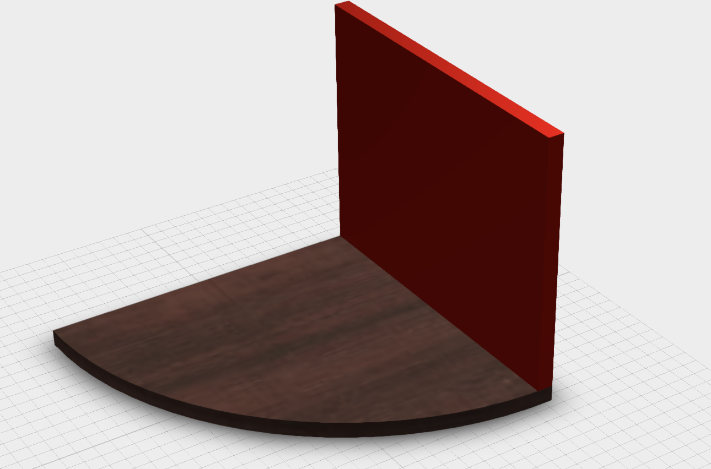
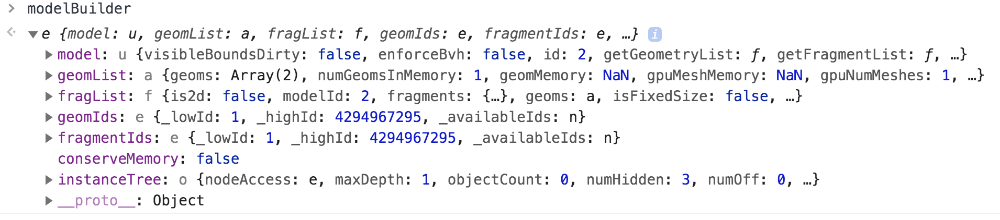

## The Hitchhiker's Guide to ... ModelBuilder in Viewer

One of our mighty engineers pointed well that each time when somebody builds a model viewer, there will be always attempts to transform it into an editor. 
Forge Viewer is not an exception and we always get questions in this context, where the most frequent one is about adding custom geometries.

Adding custom geometry to the Viewer was addressed previously in some of our blog posts and there is even a [recommended](https://forge.autodesk.com/en/docs/viewer/v7/developers_guide/advanced_options/custom-geometry/) (read "official way") of doing it.

It is not a secret that Forge Viewer is based on three.js and so far, all approaches of adding custom geometry to the Viewer, exploit three.js layer (a layer below Forge Viewer). This explains why Forge Viewer is not aware of existence of such geometry and there is no interaction with it.
To be able to select a custom geometry added this way, you have to work at three.js level and implement selection by yourself and we illustrated in some of the blogposts how to solve this using [ray casting](https://forge.autodesk.com/blog/handling-custom-meshes-selection-along-model-components-forge-viewer).

Nevertheless, with all this work, any custom geometry still feels like a foster child and tools like Measuring or Sectioning will ignore their pretty face.


### Intro

For this very reason, the engineering team developed ModelBuilder extension, which facilitates integration of custom geometry into Forge Viewer and make it play well with tools like Measuring and Sectioning.

The most simplest way of adding a custom geometry is the following:

```javascript

viewer.loadExtension("Autodesk.Viewing.SceneBuilder").then(() => {
    sceneBuilder = viewer.getExtension("Autodesk.Viewing.SceneBuilder");

    sceneBuilder.addNewModel({})
        .then((modelBuilder) => {
            let geom = new THREE.BufferGeometry().fromGeometry(
            							new THREE.BoxGeometry(210,160,10));
            let phongMaterial = new THREE.MeshPhongMaterial({
                color: new THREE.Color(1, 0, 0)
            });
            mesh = new THREE.Mesh(geom, phongMaterial);
            modelBuilder.addMesh(mesh);

        });
```

However, there is more than just this and I invite you to explore it's features by going through a sample project of customizing a model of a corner shelve by adding custom geometry to it:  


TODO: update screen with model using Mahogany appearence

### Part I: Adding a side board as custom geometry

Having our simple model, if we add the above code into a our [SimpleCustomGeometry extension](https://sample-collection.s3.amazonaws.com/assets/js/extensions/SimpleCustomGeomExt.js) we will get the following: 


With just this, we already can start working with the new geometry, it is selectable using Measuring tool we check the offset of new custom geometry to original component, for further position adjustments:


From the measuring tool we see that we should move the newly added mesh to the right by 100 units (here I am not referring to Z-axis and Y-axis on purpose).

At this point, there are three approaches of adjusting the position of newly added custom geometry:

1. #### Set position before adding mesh to the model builder:

	```javascript
	
	...
	mesh = new THREE.Mesh(geom, phongMaterial);
	mesh.matrix = new THREE.Matrix4().compose(
			        new THREE.Vector3(0, 0, -100),
			        new THREE.Quaternion(0, 0, 0, 1),
			        new THREE.Vector3(1, 1, 1)
	    );
	modelBuilder.addMesh(mesh);
	
	...
	```
	
	If we apply this approach in our extension, we will get the following result:
	
	and we still see that we should have moved up our mesh by 85 units, but let us do it using another approach.


2. #### Update the mesh position and then update the mesh:

	This approach is ok in small doses, but if you will try to build an animation using this approach, this is wrong way to do it.
	The idea is to to use ModelBuilder in-build method to replace the mesh and it works both, for changing mesh geometry, as well as changing mesh transforms:
	
	```javascript
	
		...
		mesh = new THREE.Mesh(geom, phongMaterial);
		modelBuilder.addMesh(mesh);
		
		mesh.matrix.setPosition(new THREE.Vector3(0,85,-100));
		modelBuilder.updateMesh(mesh);
		
		...
		
	```
		
	using this new position adjustments, everything starts to look better:
		
	
	
	As mentioned above, this method is very useful for changing the geometry, all that is need is to be taken care of is the transforms for the new geometry:
	
	```javascript
	
	...
	mesh = new THREE.Mesh(geom, phongMaterial);
	modelBuilder.addMesh(mesh);
	
	mesh.geometry = new THREE.BufferGeometry().fromGeometry(
									new THREE.CylinderGeometry( 105, 105, 10, 128 ));
 	mesh.geometry.computeBoundingBox();
 	mesh.matrix.makeRotationFromEuler(new THREE.Euler(Math.PI/2,0,0));
 	mesh.matrix.setPosition(new THREE.Vector3(0,0,-100));               
	modelBuilder.updateMesh(mesh);
	
	...
	```
	
	
	
 and here you have a new geometry for the side panel:
		
	

3. #### Set position after adding the mesh by transforming the related fragments:
	
	This approach will look more complicated, but it is very powerful and its complexity can be easily abstracted.
	To explain better this, let us understand first what data the ModelBuilder instance holds when we create it and add a mesh to it:
	
	
	
	There is no mention about any mesh here. The mesh object can be found "deep" inside, but Forge Viewer works differently (for performance reasons). When adding a mesh, the information is extracted and needed parts filled with it, out of which `fragments` are the most important to us now. If we want to transform our custom component, we will have to work with fragments. 
	Later we will see that fragments are so important, that we can even add geometries directly through fragments (instead of adding geometries through meshes creation, as we did above). 
	
	
	Before that, if we check `geomList.geoms` from ModelBuilder instance, we can notice that this is the place were we can find all geometries added either through mesh creation or through fragments: 
	
	
	
This important at this step, as one of the ways of getting the fragment ids associated with our component is through having the geometry.
Since in our case we have just one geometry, this is simple:


Now, knowing the fragmentID, transforming our component cannot be easier:

```javascript

let new_matrix = new THREE.Matrix4().compose(
                    new THREE.Vector3(0, 85, -100),
                    new THREE.Quaternion(0, 0, 0, 1),
                    new THREE.Vector3(1, 1, 1)
                    );

modelBuilder.changeFragmentTransform(1, new_matrix);

```

where in my case `1` is the fragmentID.

Compared with second approach, this should be the approach when experimenting with custom component animation, but ... I never told you that.

One final touch before we go further is to quickly change the material to one already available in the scene. In our case, it would be good to replace this basic red materials with the one that the initial component is using - a nice Mahogany material.

For that we will have to first find where it is stored, and many of you might already be familiar with `matman`:


We can notice the materials for both our models, but we are interested in materials of the original model, in our case `model:1|mat:0`, which we can then assign to our custom component, again through use of mighty `fragments`:


giving as a nicer look:


Nicer, but not nice enough, because the geometry from our new components lacks proper UV data, but we will take care if it a bit later.

A live illustration of the project at this stage can be found [here](https://sample-collection.s3.amazonaws.com/simple.html).
	

### Part II: Add middle shelve as custom geometry from geometry of original shelve

Bring custom geometry is useful, but not always enough. In many cases, the needed geometry is already available in the scene as another "native" component and the challenge is to extract that geometry and bring it again as a custom component for further "manipulations".

In our case, it would be nice to "clone" the original shelve component and put it above our side panel. This way, this is the first step for a customizable shelve, where a potential customer can set the needed number of corner shelves.

To achieve this, we would need to master the `renderProxy`:


From above, we see that the workflow of getting the render proxy of a fragment is to:

 - get the id of needed component, 
 - get the associated fragment ids (could be more than one), 
 - get the render proxy for that very fragment. 

The `RenderProxy` by itself is actually a Mesh, and for now, we are interested only in geometry it stores:


a bit unusual geometry structure, and now our mission (should you choose to accept it) is to translate the data from this geometry format into THREE.BufferGeometry format, which we can then use ModelBuilder extension to add custom component.

We have everything we need in `vb`, which stores position, normal, uv and index, in attributes we can see the itemOffset and itemSize and vbstride shows us the "repeating chunk size".

All what we need to do at this step is to extract this data (or at least vertex positions and the indices for face formation) and organize into way THREE.BufferGeometry structures it:


This is a quite daunting task, mainly because the original data is interleaved into a single array and you have to know how to carve from it the needed info.

Fortunately, there is a hidden shortcut created by the engineering team, kept in total secret, yet widely available to anyone, with code name `VertexEnumerator` and it can be found in the namespace with a name that should never draw nobody's attention: `Autodesk.Viewing.Private`

So, to illustrate the power of this tool, we will use it to extract the minimal needed data from renderProxy geometry and push it into THREE.Geometry:

```javascript

let geom = new THREE.Geometry();
let renderProxy = this.viewer.impl.getRenderProxy(this.viewer.model, fragmentId);

let VE = Autodesk.Viewing.Private.VertexEnumerator;

VE.enumMeshVertices(renderProxy.geometry, (v, i) => {
            geom.vertices.push(new THREE.Vector3(v.x, v.y, v.z));
        });

VE.enumMeshIndices(renderProxy.geometry, (a, b, c) => {
					geom.faces.push(new THREE.Face3(a, b, c))
			});

geom.computeFaceNormals();
```


 Having a THREE.Geometry we can easily create a BufferGeometry out of it, put into a mesh along with default material and add this "clone" to the scene:
 
```javascript

let mesh = new THREE.Mesh(
        new THREE.BufferGeometry().fromGeometry(geom),
        new THREE.MeshPhongMaterial({
            color: new THREE.Color(1, 0, 0)
        }));
        
modelBuilder.addMesh(mesh);

```

and we succeeded ... sort of ...:


The "cloned" mesh is there (I've "ghosted" the original component), but the scale doesn't look right, which means that the final look is the result of taking the geometry and scaling it up, all this being done at renderProxy level, easy to confirm and identify the scale ratio by looking at it's world matrix:


thus, the simplest way of fixing the scale, potential position and rotation, is to assign it to our newly created mesh and adjust position if needed:

```javascript

mesh.matrix = renderProxy.matrixWorld.clone();
mesh.matrix.setPosition(new THREE.Vector3(0,140,0));

```

change the material as we did before and here we go:


### Part III: Adding remaining geometry and fixing material UVs

After previous two parts, adding remaining geometry should be a breeze:

TODO: add code

TODO: add screenshot

However, a problem left unsolved is the proper mapping of side components.
If for the "cloned" shelve components, we managed to borrow the UV mapping, for a completely new components, this has to be done manually.

A closer look at attributes of geometry associated with our component will disclose that 

 

